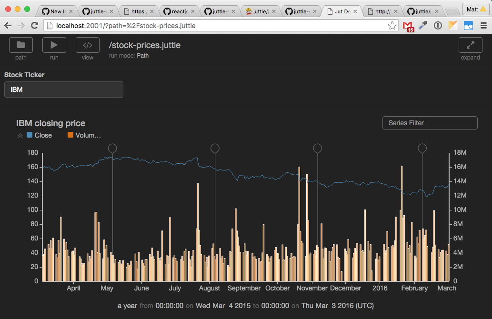

# Juttle Viewer

juttle-viewer is a development and presentation application for
[juttle](https://github.com/juttle/juttle)
programs that packages
[juttle-client-library](https://github.com/juttle/juttle-client-library),
[juttle-viz](https://github.com/juttle/juttle-viz), and application
logic to select and run juttle programs using a remote
[juttle-service](https://github.com/juttle/juttle-service).

[](https://travis-ci.org/juttle/juttle-viewer)



## Getting Started

In a production setting juttle-viewer can be run multiple ways.

Primarily, juttle-viewer is seen in
[juttle-engine](https://github.com/juttle/juttle-engine) where it is packaged
along with juttle-service.

Additionally juttle-viewer can be run by itself. It will need an instance
of juttle-service to play along with. It can be run standalone, but it also
exports an express router and can be included in an express app.

### Running Standalone

1. Install juttle-viewer: `npm install juttle-viewer`
2. Use the command script to start: `npm run juttle-viewer`

The juttle-viewer command script has several options (such as changing the
juttle-service host), that can be viewed by running `npm run juttle-viewer -h`

### Include as Express Router

Include juttle-viewer into an express app by doing this:

```javascript
var express = require('express');
var viewer = require('juttle-viewer');

var app = express();

app.use(viewer({
    juttleServiceHost: JUTTLE_SERVICE_HOST
}));
```

## Development

Once you've cloned the repo and have run `npm install`, run this:

```
./bin/juttle-viewer -d
```

Note the `-d` (or `--dev`) argument is important because it uses
webpackMiddleware to serve and continually recompile your changes.
